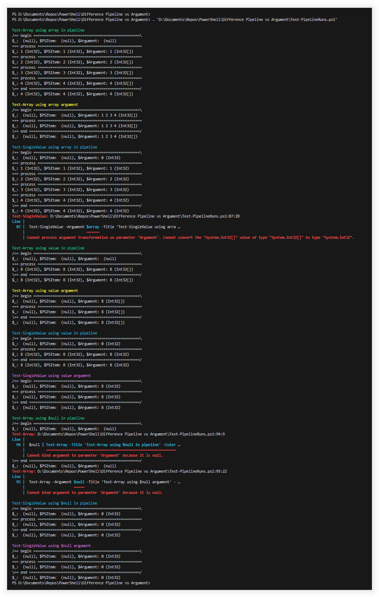

## What Difference Does It Make Using Pipeline Input Vs. Parameter Input In PowerShell

<div style="padding: 0 10% 2em;">

### Table of Contents

- [Problem Description](#problem-description)
- [Analysis](#analysis)
- [Conclusion and Workaround Solution](#conclusion-and-workaround-solution)
- [Reference](#reference)

</div>

# Problem Description

With PowerShell you can have so-called [advanced functions](https://learn.microsoft.com/en-us/powershell/module/microsoft.powershell.core/about/about_functions_advanced) optionally consume their arguments from the PowerShell pipeline instead of functions arguments.

To enable this option for your function, add a `param` parameter declaration to the top of the function body and apply the `[Parameter(ValueFromPipeline = $true)]` attribute to one of the function's parameters, e.g.:

```powershell
function Get-Function
{
  param
  ( [Parameter(ValueFromPipeline = $true)] [int[]]$PipelineArgument
  )
}
```

However, be aware that declaring an advanced function parameter for consuming values from the pipeline doesn't prevent users from still providing the same function argument as a command line parameter!

So, the following script is perfectly valid:

```powershell
$a = 1..10

Get-Function -PipelineArgument $a
```

Unfortunately, PowerShell behaves quite differently when providing a value through the pipeline vs. providing the same value as a command line argument. This important fact does not come straight into mind when programming PowerShell advanced functions, and it requires the programmer to be very careful when writing PowerShell advanced functions accepting pipeline input.

This repository tries to to shed some light on the different alternatives when using a advanced function parameter of type `ValueFromPipeline = $true` and provides an approach to circumvent the differences.

<br/>

# Analysis

In order to analyse the differences between providing a pipeline parameter argument either by pipeline or by command line argument, I set up a test matrix, calling an advanced function using both options with different kinds of arguments.

This repository contains the PowerShell script that is executing the test matrix and outputting the test results.

The following two advanced functions are declared within this PowerShell script:

1. A function accepting an **array** data type value as pipeline input:

   ```powershell
   function Test-Array { param ( [Parameter(ValueFromPipeline = $true)] [int[]]$Argument ) ... }
	 ```
1. A function accepting a **scalar** data type value as pipeline input:

   ```powershell
   function Test-SingleValue { param ( [Parameter(ValueFromPipeline = $true)] [int]$Argument ) ... }
	 ```

Each of the two functions is being called with …
1. An array value
1. A scalar value
1. `$null`

… using the pipeline and command line argument each.

<br/>

## Analysis Result

The result set is a matrix of `2 * 3 * 2` (= `12`) iterations:

- 2 functions
- 3 different values
- 2 calling types (pipeline vs. argument)

<table>
	<thead>
		<tr>
			<th>Calling Type</th>
			<th>Parameter Type</th>
			<th>Argument Type</th>
			<th>Initial Value</th>
			<th>Iterations</th>
			<th>Data Type</th>
		</tr>
	</thead>
	<tbody>
		<tr style="color: #ccc; background-color: #224;">
			<td>Pipeline</td>
			<td>array</td>
			<td>array</td>
			<td><code>null</code></td>
			<td>multiple</td>
			<td>array</td>
		</tr>
		<tr style="color: #ccc; background-color: #224;">
			<td>Argument</td>
			<td>array</td>
			<td>array</td>
			<td>array</td>
			<td>single</td>
			<td>array</td>
		</tr>
		<tr style="color: #ccc; background-color: #232;">
			<td>Pipeline</td>
			<td>scalar</td>
			<td>array</td>
			<td><code>default</code></td>
			<td>multiple</td>
			<td>scalar</td>
		</tr>
		<tr style="color: #ccc; background-color: #232;">
			<td>Argument</td>
			<td>scalar</td>
			<td>array</td>
			<td colspan="3" style="color: #d99; background-color: #422; text-align: center;"><i>– Exception –</i></td>
		</tr>
		<tr style="color: #ccc; background-color: #224;">
			<td>Pipeline</td>
			<td>array</td>
			<td>scalar</td>
			<td><code>null</code></td>
			<td>multiple</td>
			<td>array</td>
		</tr>
		<tr style="color: #ccc; background-color: #224;">
			<td>Argument</td>
			<td>array</td>
			<td>scalar</td>
			<td>array</td>
			<td>single</td>
			<td>array</td>
		</tr>
		<tr style="color: #ccc; background-color: #232;">
			<td>Pipeline</td>
			<td>scalar</td>
			<td>scalar</td>
			<td><code>default</code></td>
			<td>multiple</td>
			<td>scalar</td>
		</tr>
		<tr style="color: #ccc; background-color: #232;">
			<td>Argument</td>
			<td>scalar</td>
			<td>scalar</td>
			<td>scalar</td>
			<td>single</td>
			<td>scalar</td>
		</tr>
		<tr style="color: #ccc; background-color: #224;">
			<td>Pipeline</td>
			<td>array</td>
			<td><code>null</code></td>
			<td><code>null</code></td>
			<td style="color: #d99; background-color: #422; text-align: center;"><i>– Exception –</i></td>
			<td><code>null</code></td>
		</tr>
		<tr style="color: #ccc; background-color: #224;">
			<td>Argument</td>
			<td>array</td>
			<td><code>null</code></td>
			<td colspan="3" style="color: #d99; background-color: #422; text-align: center;"><i>– Exception –</i></td>
		</tr>
		<tr style="color: #ccc; background-color: #232;">
			<td>Pipeline</td>
			<td>scalar</td>
			<td><code>null</code></td>
			<td><code>default</code></td>
			<td>multiple</td>
			<td>scalar</td>
		</tr>
		<tr style="color: #ccc; background-color: #232;">
			<td>Argument</td>
			<td>scalar</td>
			<td><code>null</code></td>
			<td>scalar</td>
			<td>single</td>
			<td>scalar</td>
		</tr>
	</tbody>
</table>

<br/>

From this table you can see nicely that the initial value of the argument within the `begin` code block and the number of `process` code block iterations differ significantly between providing an argument through the pipeline or as command line argument.

Moreover, declaring a pipeline parameter as **scalar** or **array** data type causes a significant difference in how argument data is coerced. As you can see from the results of running this repository's PowerShell script, coercion fails if the data type conversion cannot be performed by the corresponding pipeline/argument processing branch of the internal PowerShell code.

<br/>

# Conclusion And Workaround Solution

The difference in how the same function argument gets processed depending on whether it is provided through the PowerShell pipeline or through command line argument causes two very different process workflows to be programmed, depending on whether the argument was provided by pipeline or by argument.

To avoid writing two different workflows, resulting in introducing code duplication and raising the chance of adding errors to your code, I suggest to use a small piece of boilerplate code. I "merges" the two different workflows back into one.

The suggested boilerplate code checks whether the pipeline parameter was provided by command line argument and calls the same function again, this time using the pipeline. So, the code just needs to implement the pipeline processing workflow.

For this boilerplate code to work, the pipeline parameter must be declared as an **array**. This allows to check for a `null` value provided to the parameter variable in the `begin` code block. Using a scalar value we wouldn't be able to distinguish between a valid initial value and the scalar's `default` value.

Please note that if `null` is a valid input for your advanced function, you need to take appropiate precautions. From above execution table you can see that providing a `null` value to the pipeline raises a [`NullReferenceException`](https://learn.microsoft.com/en-us/dotnet/api/system.nullreferenceexception) as there is no array to iterate over.

## Example Implementation

```powershell
function Test-Function
{
  param
  ( [Parameter(Mandatory = $true, Position = 0, ValueFromPipeline = $true)][int[]]$PipelineArgument
  , [Parameter(Mandatory = $true, Position = 1)][string]$StandardArgument
  , [Parameter(Mandatory = $false, Position = 2)][switch]$SwitchArgument
  )

  begin
  {
    if ($PipelineArgument)
    {
      $PipelineArgument | Test-Function -StandardArgument:$StandardArgument -SwitchArgument:$SwitchArgument
      exit
    }

    [bool]$success = $true
  }

  process { ... }
  end { ... }
}
```

<br/>

# Reference

The following output is created by this repository's test matrix PowerShell script:

```powershell
Test-Array using array in pipeline
/== begin ==================================================\
$_:  (null), $PSItem:  (null), $Argument:  (null)
=== process =================================================
$_: 1 (Int32), $PSItem: 1 (Int32), $Argument: 1 (Int32[])
=== process =================================================
$_: 2 (Int32), $PSItem: 2 (Int32), $Argument: 2 (Int32[])
=== process =================================================
$_: 3 (Int32), $PSItem: 3 (Int32), $Argument: 3 (Int32[])
=== process =================================================
$_: 4 (Int32), $PSItem: 4 (Int32), $Argument: 4 (Int32[])
\== end ====================================================/
$_: 4 (Int32), $PSItem: 4 (Int32), $Argument: 4 (Int32[])
```
```powershell
Test-Array using array argument
/== begin ==================================================\
$_:  (null), $PSItem:  (null), $Argument: 1 2 3 4 (Int32[])
=== process =================================================
$_:  (null), $PSItem:  (null), $Argument: 1 2 3 4 (Int32[])
\== end ====================================================/
$_:  (null), $PSItem:  (null), $Argument: 1 2 3 4 (Int32[])
```
```powershell
Test-SingleValue using array in pipeline
/== begin ==================================================\
$_:  (null), $PSItem:  (null), $Argument: 0 (Int32)
=== process =================================================
$_: 1 (Int32), $PSItem: 1 (Int32), $Argument: 1 (Int32)
=== process =================================================
$_: 2 (Int32), $PSItem: 2 (Int32), $Argument: 2 (Int32)
=== process =================================================
$_: 3 (Int32), $PSItem: 3 (Int32), $Argument: 3 (Int32)
=== process =================================================
$_: 4 (Int32), $PSItem: 4 (Int32), $Argument: 4 (Int32)
\== end ====================================================/
$_: 4 (Int32), $PSItem: 4 (Int32), $Argument: 4 (Int32)
```
```powershell
Test-SingleValue: D:\Documents\Repos\PowerShell\Difference Pipeline vs Argument\Test-PipelineRuns.ps1:87:28
Line |
  87 |  Test-SingleValue -Argument $array -Title 'Test-SingleValue using arra …
     |                             ~~~~~~
     | Cannot process argument transformation on parameter 'Argument'. Cannot convert the "System.Int32[]" value of type "System.Int32[]" to type "System.Int32".
```
```powershell
Test-Array using value in pipeline
/== begin ==================================================\
$_:  (null), $PSItem:  (null), $Argument:  (null)
=== process =================================================
$_: 8 (Int32), $PSItem: 8 (Int32), $Argument: 8 (Int32[])
\== end ====================================================/
$_: 8 (Int32), $PSItem: 8 (Int32), $Argument: 8 (Int32[])
```
```powershell
Test-Array using value argument
/== begin ==================================================\
$_:  (null), $PSItem:  (null), $Argument: 8 (Int32[])
=== process =================================================
$_:  (null), $PSItem:  (null), $Argument: 8 (Int32[])
\== end ====================================================/
$_:  (null), $PSItem:  (null), $Argument: 8 (Int32[])
```
```powershell
Test-SingleValue using value in pipeline
/== begin ==================================================\
$_:  (null), $PSItem:  (null), $Argument: 0 (Int32)
=== process =================================================
$_: 8 (Int32), $PSItem: 8 (Int32), $Argument: 8 (Int32)
\== end ====================================================/
$_: 8 (Int32), $PSItem: 8 (Int32), $Argument: 8 (Int32)
```
```powershell
Test-SingleValue using value argument
/== begin ==================================================\
$_:  (null), $PSItem:  (null), $Argument: 8 (Int32)
=== process =================================================
$_:  (null), $PSItem:  (null), $Argument: 8 (Int32)
\== end ====================================================/
$_:  (null), $PSItem:  (null), $Argument: 8 (Int32)
```
```powershell
Test-Array using $null in pipeline
/== begin ==================================================\
$_:  (null), $PSItem:  (null), $Argument:  (null)
Test-Array: D:\Documents\Repos\PowerShell\Difference Pipeline vs Argument\Test-PipelineRuns.ps1:94:9
Line |
  94 |  $null | Test-Array -Title 'Test-Array using $null in pipeline' -Color …
     |          ~~~~~~~~~~~~~~~~~~~~~~~~~~~~~~~~~~~~~~~~~~~~~~~~~~~~~~~~~~~~~
     | Cannot bind argument to parameter 'Argument' because it is null.
\== end ====================================================/
$_:  (null), $PSItem:  (null), $Argument:  (null)
```
```powershell
Test-Array: D:\Documents\Repos\PowerShell\Difference Pipeline vs Argument\Test-PipelineRuns.ps1:95:22
Line |
  95 |  Test-Array -Argument $null -Title 'Test-Array using $null argument' - …
     |                       ~~~~~
     | Cannot bind argument to parameter 'Argument' because it is null.
```
```powershell
Test-SingleValue using $null in pipeline
/== begin ==================================================\
$_:  (null), $PSItem:  (null), $Argument: 0 (Int32)
=== process =================================================
$_:  (null), $PSItem:  (null), $Argument: 0 (Int32)
\== end ====================================================/
$_:  (null), $PSItem:  (null), $Argument: 0 (Int32)
```
```powershell
Test-SingleValue using $null argument
/== begin ==================================================\
$_:  (null), $PSItem:  (null), $Argument: 0 (Int32)
=== process =================================================
$_:  (null), $PSItem:  (null), $Argument: 0 (Int32)
\== end ====================================================/
$_:  (null), $PSItem:  (null), $Argument: 0 (Int32)
```

<br/>

Or, as colored screenshot:


